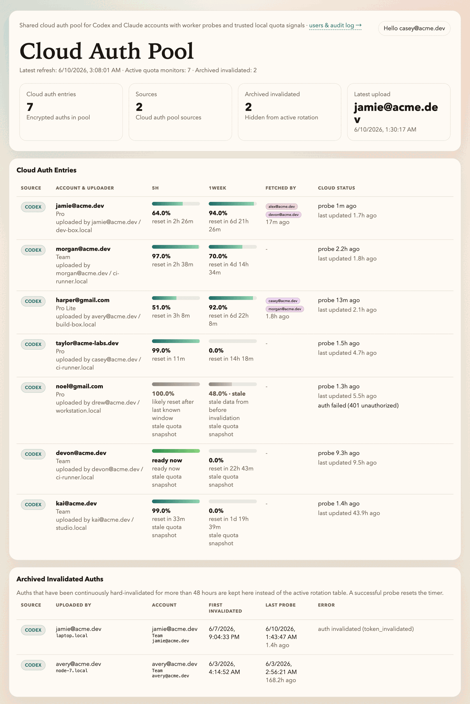

# Quota Report Hub

Minimal Vercel app that stores encrypted Codex and Claude auth snapshots, issues per-user access tokens by company email, and serves a dashboard plus source-aware auth-pool APIs for local quota guards.



*The dashboard: every cloud auth entry with its latest 5H / 1week quota, who fetched it, and the cloud probe status — plus archived auths that have stayed invalidated. (Accounts shown are anonymized demo data.)*

## Use Case

This project is built for people who regularly switch between multiple coding agents and multiple accounts, and need a shared place to see remaining quota without manually checking each machine.

The default shared hub URL for this project is:

- [quota-report-hub.vercel.app](https://quota-report-hub.vercel.app)

That hub now requires a valid personal access token to read dashboard data. Publishing the repo does not expose the live hub data by itself.

Typical examples:

- You switch between multiple Codex and Claude accounts across laptops, desktops, and servers
- You keep separate accounts on different laptops, desktops, or remote boxes
- You want one dashboard that shows the current cloud auth pool and the latest known quota attached to each cloud auth entry
- You want each machine to check quota automatically every 15 minutes instead of checking manually before switching agents
- You want reporting to resume automatically after a laptop reboot or a remote server restart

## Install The Skill

This repo also publishes the reusable `quota-reporter` skill.

Install it with:

```bash
npx skills add https://github.com/callzhang/quota-report-hub --skill quota-reporter -g -y
```

Skill files live under:

- `skills/quota-reporter/SKILL.md`
- `skills/quota-reporter/README.md`
- `skills/quota-reporter/scripts/quota_guard.py`
- `skills/quota-reporter/scripts/install_quota_guard.py`
- `skills/quota-reporter/scripts/trigger_remote_probe.py`
- `skills/quota-reporter/scripts/claude_statusline_probe.py`
- `skills/quota-reporter/scripts/quota_reporters.py`
- `skills/quota-reporter/archive/`

After install, teammates can either:

- run one local guard check with `quota_guard.py`
- install scheduled checking with `install_quota_guard.py`

## Local Frontend

Run the static dashboard frontend on the fixed local port:

```bash
npm run dev
```

The startup script listens on `127.0.0.1:6088` by default. If port `6088` is already occupied, startup fails with an error instead of switching to another port. Set `FRONTEND_PORT` only when you intentionally want a different fixed port:

```bash
FRONTEND_PORT=7000 npm run dev
```

This script serves the static dashboard files only. Use the deployed hub or `vercel dev` when you need local API routes.

## Recommended User Flow

The intended end-to-end flow inside Codex is:

1. The user asks Codex to install the skill and provides the GitHub repo URL.
2. Codex installs the `quota-reporter` skill.
3. Codex uses the default hosted hub at `https://quota-report-hub.vercel.app/` unless the user provides a different hub URL.
4. If the user wants a new hub, Codex runs `scripts/deploy_vercel.py` with:
   - `allowed domain`
   - `mailgun api key`
   - `sending email`
5. If the user provides a different hub URL, Codex should verify that the hub supports:
   - `POST /api/auth/issue-token`
   - `POST /api/auth/upload`
   - `POST /api/auth/fetch-best`
6. Codex asks for the user's company email.
7. The installer requests a personal token by email and asks the user to paste it back into the terminal.
8. Codex writes:
   - `auth_pool_url`
   - `auth_pool_user_email`
   - `auth_pool_user_token`
   into `~/.agents/auth/quota-reporter.json`
9. Codex installs the 15-minute scheduler.
10. Codex verifies the scheduler registration and runs one immediate guard cycle. The install is not complete until this verification succeeds.
10. Every 15 minutes the guard:
   - checks GitHub for the latest `quota-reporter` skill code and updates the local installed skill when `main` has changed
   - reads current local auth state for each supported source
   - updates local `~/.agents/auth/known_auth.json`
   - reuploads the current auth to keep the cloud auth pool entry present even when the local digest has not changed
   - checks the current local Codex quota and Claude quota
   - reports stable local quota snapshots back to the hub when available; Codex client reports are accepted only when both windows are complete or the local auth is hard-invalidated
   - if a local source is below threshold, sends `source + current account + current quota` to `/api/auth/fetch-best`
   - installs a better auth only when the server returns one for that same source
   - opens a persistent system dialog when any auth uploaded by that user is hard-invalidated, even if that auth is not the currently installed local auth

Important runtime notes:

- each run reads the current local auth for each supported source
- each run self-updates the installed skill from `https://github.com/callzhang/quota-report-hub` before probing, unless `--skip-self-update` is passed for debugging
- each machine stores only one local state file: `~/.agents/auth/known_auth.json`
- the local guard probes the current local Codex auth and Claude auth
- if Codex has less than `20%` remaining in the `5H` window, or less than `5%` remaining in the `1week` window, the machine asks the cloud auth pool for a better Codex auth
- if Claude has less than `20%` remaining in the `5H` window, or less than `5%` remaining in the `1week` window, the machine asks the cloud auth pool for a better Claude auth
- the request to `/api/auth/fetch-best` includes:
  - `source`
  - the current local `account_id`
  - the current local `5H remaining percent`
  - the current local `1week remaining percent`
  - a local `requester_id` such as `user@hostname`, so machines sharing the same hub token are still spread across different replacement auths
- the server only returns a replacement when it is strictly better than the current local auth for that same source
- the server only shares candidate auths that still have at least `20%` remaining in the `5H` window and at least `5%` remaining in the `1week` window
- replacement selection is weighted by remaining quota: the server uses requester-specific deterministic weighted sampling with a softened quota weight, plus a small active-assignment penalty, so high-quota accounts carry more load without taking nearly every request
- the server also tracks active assignments by each machine's latest fetch event; an auth already installed on many machines is treated as loaded even if those machines have not fetched again within the last 5 hours
- local quota reports are also used as active-assignment evidence: each reporter's latest Codex account contributes to that auth's load, which catches machines that keep using an auth without calling `fetch-best`
- local upload is idempotent: even when `known_auth.json` records the same uploaded `account_id`, `auth_last_refresh`, and digest, the guard reuploads the current auth so a missing cloud entry can be restored automatically
- uploading a new current auth does not delete older auths previously uploaded by the same user; the hub keeps monitoring all of them so invalidated-owner notifications still work
- if a fetched shared auth is later reuploaded by another machine, the hub preserves the first uploader for that `source + account_id`; using someone else's shared auth does not make that user responsible for re-login notifications
- if the same account is refreshed locally, the new `auth_last_refresh` will force a new upload and overwrite the old cloud copy
- Codex auth-pool identity is normalized to the lowercased account email when the email is available, so Team users who share a provider-side account UUID do not overwrite each other in the pool
- the guard only replaces local `~/.codex/auth.json` when the fetched auth is different from the currently installed auth
- replacing `~/.codex/auth.json` does not hot-switch already running Codex sessions. New auth usually takes effect in the next new session.
- if the cloud has no better auth than the current one, the guard does nothing and keeps the current auth installed.
- `~/.agents/auth/quota-reporter.json` should stay private because it contains the user's personal auth-pool token.
- the hub dashboard also uses the same personal token. Without a valid token, `/api/status` returns `401` and the page stays locked.
- every time a user requests a new token by email, the old token is revoked. Only the latest token for that email remains valid, even if that latest token is then reused across multiple machines.
- when a request uses an invalid or expired hub-signed token, the hub returns `401` with `token_invalidated`. The local guard requests a new token email once for that invalid local token, then waits for the user to paste the latest token.
- deleted legacy opaque `qrp_...` tokens cannot be upgraded in-band because they do not carry a verifiable email; request a fresh token by email once on that machine.
- old local reporter scripts now live under `skills/quota-reporter/archive/`

The dashboard now reflects the cloud auth pool, not arbitrary client report rows:

- each visible row should correspond to one cloud-stored auth entry
- quota metadata is shown as the latest effective quota associated with that cloud auth entry
- hard-invalidated auths should not remain selectable
- stale windows may still be shown for soft probe failures, but only as metadata attached to the cloud auth entry
- Codex rows can be refreshed by either the cloud worker or a stable local client report; a complete local client report is allowed to replace stale worker-preserved windows. After a stable local client report is accepted, the cloud worker skips probing that same auth for 1 hour when the report matches the auth refresh time. A newer worker soft failure does not overwrite an existing good local Codex quota snapshot
- Claude rows can be refreshed by the cloud worker for direct Claude subscriptions, or by stable local client reports when Claude is running in an environment that the worker cannot replay reliably. Local Claude reporting reads the statusline snapshot first, then falls back to the OAuth usage API when the statusline has no quota windows; a 429 response with `Retry-After` is reported as a zero-remaining `5H` window until that reset time. Claude Code only sends `rate_limits` after the first successful API response in a session, so the statusline capture preserves any previous unexpired `5H` or `7d` window instead of overwriting it with a startup snapshot that has no quota.

Auth pool support:

- The hub can now store encrypted Codex and Claude auth snapshots in a server-side auth pool.
- Employees request a personal auth-pool token by company email through `/api/auth/issue-token`.
- Each email can have only one active token at a time; a newly issued token revokes all older tokens for that email.
- Machines upload only their current auth to `/api/auth/upload` with an explicit `source`.
- Codex uploads are keyed by normalized email when available, not by the raw provider account UUID, so different Team users do not collide in the pool.
- GitHub Actions refreshes the cloud auth pool every 15 minutes by running `scripts/probe_auth_pool_worker.mjs`.
- Local machines may also post stable quota snapshots to `/api/auth/quota`. For Codex, the server accepts only complete windows or hard invalidations so partial client probes cannot poison the hub. A complete client report can replace stale effective windows that were previously preserved from worker data.
- A fresh accepted client quota report backs off the GitHub Actions cloud probe for that same auth for 1 hour, as long as the report's `auth_last_refresh` still matches the auth pool entry.
- Turso stores auth-pool metadata, quota snapshots, and audit events. `/api/status` and `/api/auth/fetch-best` candidate selection read metadata only; they do not read encrypted auth JSON for every account.
- In production, configure Tigris object storage so encrypted auth JSON is written to object storage and Turso keeps only `auth_blob_key`. Existing inline Turso rows remain readable and are moved to object storage when that auth is refreshed and uploaded again.
- During the Codex CLI probe, if the temporary auth blob is refreshed to a newer same-account auth, the worker writes that refreshed auth back into the cloud auth pool before finishing the run.
- Every probe result is appended to `auth_pool_quota_events` before the latest row is updated or an unusable auth is removed, so invalidation windows and audit views can be reconstructed from Turso instead of GitHub Actions logs.
- Codex auths are removed from the active pool after consecutive `auth failed (401 unauthorized)` worker probes, because repeated 401 means the saved token cannot be reused by the pool.
- A Vercel cron endpoint checks the cloud probe results daily. If a cloud auth stays hard-invalidated for more than 24 hours, Vercel emails the uploader and asks them to log in again. It sends at most one reminder per account per 24 hours until the auth recovers.
- The local guard also checks `/api/status` every run and opens one persistent system dialog for hard-invalidated auths uploaded by the current token user, including auths that are not currently installed on this machine. Before opening it, the guard checks whether the same login-required dialog is already visible so the 15-minute scheduler does not create duplicates.
- Claude quota is probed in the worker by launching Claude CLI headlessly, restoring the saved CLI state, and reading the statusline snapshot after a minimal real request.
- Claude auth snapshots are uploaded to the cloud pool only when the local machine is using a direct Claude subscription. Machines that inject `ANTHROPIC_*` credentials through `~/.claude/settings.json` are skipped because their active provider is not the worker's official Claude login path.
- The Claude worker uses a short statusline refresh interval during probing so the snapshot is emitted before the worker timeout expires.
- A client can request the best currently usable auth from `/api/auth/fetch-best`, but it must send the same explicit `source`.
- Fetch access is gated by contribution at the user level: once a user has uploaded at least one healthy Codex or Claude auth, they may fetch any supported source. Candidate selection still stays source-specific, so Codex never receives Claude auth and Claude never receives Codex auth.
- The dashboard API at `/api/status` also requires the same personal bearer token.
- The selection logic only compares candidates within the same source, prefers the highest `5H remaining`, then `1week remaining`, and skips hard-invalidated auths.
- Soft probe failures such as missing quota details can still contribute stale-but-last-known-good windows; hard token invalidations clear the old windows.
- The auth pool requires server-side encryption plus Mailgun delivery for issuing personal user tokens.
- The auth pool deduplicates by stable `source + account_id`, preserves the first uploader as the account owner, and only replaces an existing entry when the incoming `auth_last_refresh` is newer. If two machines upload different files for the same account without a newer refresh time, the cloud keeps the existing entry.

The installer is reboot-safe and runs every 15 minutes:

- macOS uses `launchd` with `RunAtLoad`
- Linux uses `crontab` with both `@reboot` and `*/15 * * * *` entries
- Windows uses Task Scheduler with an `AtStartup` trigger plus a 15-minute repeating trigger

The installer also performs a post-install verification by default:

- confirms the scheduler is registered with `launchd`, `crontab`, or Task Scheduler
- runs `quota_guard.py --skip-self-update --no-toast` once immediately
- exits with an error if the guard cannot run, so the installing agent must inspect `~/.agents/auth/quota-guard.log` and `~/.agents/auth/quota-guard.error.log` and fix the local environment before considering setup complete

## Endpoints

- `GET /api/status`
  - Requires a personal bearer token
  - Returns the current dashboard dataset

## Required environment variables

- `AUTH_POOL_ENCRYPTION_KEY`
- `MAILGUN_API_KEY`
- `MAILGUN_DOMAIN`
- `MAILGUN_FROM`
- `CRON_SECRET`
- `TURSO_DATABASE_URL`
- `TURSO_AUTH_TOKEN`
- `TIGRIS_STORAGE_ACCESS_KEY_ID`
- `TIGRIS_STORAGE_SECRET_ACCESS_KEY`
- `TIGRIS_STORAGE_BUCKET`

`AUTH_POOL_ENCRYPTION_KEY` must be either:

- 64 hex characters
- or base64 for exactly 32 raw bytes

The Tigris variables are read automatically by `@tigrisdata/storage`. They are required for production auth-pool uploads if auth JSON should stay out of Turso read paths.

## Auth blob migration

Use `scripts/migrate_auth_blobs_to_object_storage.mjs` to move existing inline encrypted auth payloads out of Turso rows and into object storage.

Modes:

- `scan`: prepares schema and counts rows that still have inline encrypted auth payloads. It does not write objects or update rows.
- `write-only`: writes each encrypted payload envelope to object storage and reads it back for verification. It does not update rows.
- `apply`: writes and verifies each object, writes a JSONL backup of the encrypted envelopes, then clears the inline columns and stores `auth_blob_key`.

Local rehearsal:

```bash
cp database-beige-bell.db /tmp/database-beige-bell-auth-blob-migration.db

AUTH_BLOB_STORAGE_DIR=/tmp/quota-auth-blob-local-test \
node scripts/migrate_auth_blobs_to_object_storage.mjs \
  --db /tmp/database-beige-bell-auth-blob-migration.db \
  --mode scan \
  --limit 100

AUTH_BLOB_STORAGE_DIR=/tmp/quota-auth-blob-local-test \
node scripts/migrate_auth_blobs_to_object_storage.mjs \
  --db /tmp/database-beige-bell-auth-blob-migration.db \
  --mode write-only \
  --limit 100

AUTH_BLOB_STORAGE_DIR=/tmp/quota-auth-blob-local-test \
node scripts/migrate_auth_blobs_to_object_storage.mjs \
  --db /tmp/database-beige-bell-auth-blob-migration.db \
  --mode apply \
  --limit 100 \
  --backup-path /tmp/quota-auth-blob-local-backup.jsonl
```

Remote execution:

```bash
node scripts/migrate_auth_blobs_to_object_storage.mjs --remote --mode scan --limit 10
node scripts/migrate_auth_blobs_to_object_storage.mjs --remote --mode write-only --limit 10
node scripts/migrate_auth_blobs_to_object_storage.mjs --remote --mode apply --limit 10 --backup-path /tmp/quota-auth-blob-remote-backup.jsonl
node scripts/migrate_auth_blobs_to_object_storage.mjs --remote --mode apply --limit 1000 --backup-path /tmp/quota-auth-blob-remote-backup.jsonl
```

Before remote `apply`, confirm these variables are available to the process:

- `TURSO_DATABASE_URL`
- `TURSO_AUTH_TOKEN`
- `TIGRIS_STORAGE_ACCESS_KEY_ID`
- `TIGRIS_STORAGE_SECRET_ACCESS_KEY`
- `TIGRIS_STORAGE_BUCKET`

Before remote rows are migrated, also configure the same three Tigris values as GitHub Actions secrets, because the scheduled probe worker reads object-backed auth rows.

## Vercel deploy script

Use the included deploy script to configure the auth-pool email settings on Vercel and trigger a production deploy:

```bash
python3 scripts/deploy_vercel.py \
  --allowed-domain stardust.ai \
  --mailgun-api-key YOUR_MAILGUN_API_KEY \
  --sending-email hello@friday.preseen.ai
```

What it does:

- sets `AUTH_ALLOWED_EMAIL_DOMAIN`
- sets `MAILGUN_API_KEY`
- derives `MAILGUN_DOMAIN` from the sending email domain
- sets `MAILGUN_FROM`
- generates `AUTH_POOL_ENCRYPTION_KEY` only if one does not already exist
- updates `production`, `preview`, and `development`
- runs `vercel deploy --prod --yes`

Important:

- the script preserves an existing `AUTH_POOL_ENCRYPTION_KEY` by default, because rotating it would make previously encrypted auth-pool rows unreadable
- use `--rotate-auth-pool-key` only when you intentionally want to invalidate existing encrypted auth-pool entries
- use `--skip-deploy` if you only want to update Vercel env values without deploying immediately

## Scheduler

The hosted hub uses GitHub Actions, not Vercel cron, for the 15-minute Codex server probe loop.

- workflow file: `.github/workflows/probe-auth-pool.yml`
- required GitHub secrets:
  - `TURSO_DATABASE_URL`
  - `TURSO_AUTH_TOKEN`
  - `AUTH_POOL_ENCRYPTION_KEY`

## Auth Pool Workflow

1. Install the local guard and request a personal auth-pool token by company email:

```bash
python3 skills/quota-reporter/scripts/install_quota_guard.py \
  --email your.name@stardust.ai
```

If you want to use a different hub URL, pass `--auth-pool-url`. The default is `https://quota-report-hub.vercel.app/`.

2. The installer emails a personal token to `your.name@stardust.ai` and prompts you to paste it locally.

3. The installer validates behavior immediately. It verifies scheduler registration and runs one guard cycle before it exits successfully.

```bash
python3 skills/quota-reporter/scripts/quota_guard.py
```

By default this prints a compact human-readable summary. Use `--json` only when you need the full probe, sync, replacement, notification, and timing payload:

```bash
python3 skills/quota-reporter/scripts/quota_guard.py --json
```

You can still run one local check manually after login changes:

```bash
python3 skills/quota-reporter/scripts/quota_guard.py
```

4. The guard automatically:

- updates local `known_auth.json`
- reuploads the current local auth for each source to the cloud auth pool so a missing entry can recover automatically
- probes local Codex and Claude quota
- pushes stable local quota snapshots to the hub when available
- for Codex, only complete windows or hard invalidations are sent, so local partial probes never overwrite good hub data
- if Codex reports a usage-limit hit with one missing window, the guard derives a complete `0%` snapshot from structured reset metadata before posting to the hub
- when a local source is low, sends `source + current account + current quota` to `/api/auth/fetch-best`
- installs a replacement only when the server returns a strictly better auth for that same source
- if the uploader has an invalidated auth, the server returns it as `repair_auth` without a shared replacement, and the local guard installs it so the owner can re-login/refresh their own auth
- each `repair_auth` return is also written to the audit log as `repair_auth_returned` and appears in the Users & Audit page

5. If needed, trigger one immediate cloud probe cycle and watch the GitHub worker:

```bash
python3 skills/quota-reporter/scripts/trigger_remote_probe.py
```

## Local test

```bash
npm install
npm test
```
